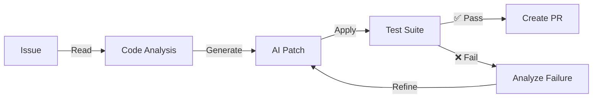

# Victory

🚀 **AI-Powered Bug Fixing Tool**

Victory is a CLI tool that automatically fixes bugs and implements features in your codebase. Describe an issue or provide a GitHub issue number, and Victory will generate a fix, test it, iterate on failures, and create a pull request - all automatically.

##  Features

- **Global CLI Tool** - Install once, use anywhere with `npm install -g @sriz/victory`
- **Easy Setup** - One command initialization with `victory --init`
- **Automatic Code Analysis** - Understand issues and relevant code context
- **AI-Powered Fixes** - Generate patches using Claude, GPT-4, Gemini, Modal, or other LLMs
- **Validation & Testing** - Runs your test suite to verify fixes work
- **Smart Iteration** - Refines failed fixes up to 5 times automatically
- **GitHub Integration** - Creates pull requests directly, fetches issues
- **Cost Control** - Set daily budgets, monitor token usage per project
- **Extensible** - Custom plugins for languages, VCS, CI/CD systems

##  Installation & Quick Start

### Global Installation

```bash
npm install -g @sriz/victory
```

### Initialize a Project

```bash
cd your-project
victory --init
```

This will guide you through:
1. Choose LLM provider (OpenAI, Claude, Gemini, Modal, Kimi)
2. Enter API key
3. Set daily budget
4. Select test framework

### Set Up GitHub Token

```bash
victory --set-github-token
```

This stores your GitHub Personal Access Token to access repositories.

## Quick Start Workflow

### Step 1: Setup Your LLM Provider

Choose your preferred LLM provider:
- **Modal** (FREE): Get your token from [modal.com](https://modal.com)
- **OpenAI** (paid): Get your token from [openai.com](https://openai.com)
- **Gemini** (paid): Get your token from [google.com/ai/gemini](https://google.com/ai/gemini)
- **Claude** (paid): Get your token from [anthropic.com](https://anthropic.com)

```bash
# Setup with your own token
victory setup-modal YOUR_MODAL_API_KEY

# Or use interactively (will prompt for token)
victory setup-modal
```

### Step 2: Setup GitHub Token

Configure your GitHub Personal Access Token to access your repositories:

```bash
victory set-github-token
```

You'll be prompted to enter your GitHub token. This allows Victory to:
- List issues from your repositories
- Fetch issue details
- Create pull requests with fixes

### Step 3: List Issues from a Repository

See all open issues in any of your repositories:

```bash
# From a repo URL
victory list-issues https://github.com/owner/repo

# Or use owner/repo format
victory list-issues owner/repo

# Or provide interactively
victory list-issues  # Will prompt for repo URL
```

Output shows:
- Issue number
- Title
- Labels
- Status
- Link to issue

### Step 4: Fix an Issue with AI

Use the LLM to automatically fix any issue:

```bash
# Fix issue #42 in a repository
victory fix 42 https://github.com/owner/repo

# Or use owner/repo format
victory fix 42 owner/repo

# Or provide the repo interactively
victory fix 42  # Will prompt for repo URL
```

Victory will:
1. Fetch the issue details from GitHub
2. Analyze the issue description
3. Use Modal LLM to generate a fix
4. Show you the proposed patch
5. You can then apply, test, and create a PR

## Complete Example Workflow

```bash
# 1. First time - setup your LLM provider (get token from modal.com, openai.com, etc.)
victory setup-modal YOUR_API_KEY

# 2. Setup GitHub once
victory set-github-token

# 3. List issues in your repo
victory list-issues owner/my-project

# 4. Fix issue #5
victory fix 5 owner/my-project

# 5. Fix issue #10 from different repo
victory fix 10 owner/another-project

# 6. Fix issue #3 with interactive prompts
victory fix 3
# Will ask for repo URL
```

**→ [Full Installation Guide](docs/INSTALL.md)**

## CLI Commands

### Available Commands

```bash
# Setup Modal API token (do this first!)
victory setup-modal [TOKEN]
# Interactive mode if no token provided

# Setup GitHub Personal Access Token
victory set-github-token
# Required for accessing repositories

# List all issues in a repository
victory list-issues [REPO_URL_OR_OWNER/REPO]
# Shows all open issues with details

# Fix a specific Github issue
victory fix <ISSUE_NUMBER> [REPO_URL_OR_OWNER/REPO]
# Uses AI to generate a fix for the issue

# Plan how to fix a GitHub issue
victory plan <ISSUE_ID>
# Analyzes issue and proposes solution

# Apply an existing patch
victory apply <PLAN>
# Applies previously generated patch
```

### Command Examples

```bash
# One-time setup (use your own API key)
victory setup-modal YOUR_API_KEY
victory set-github-token

# List issues from different repo formats
victory list-issues ansh/victory
victory list-issues https://github.com/ansh/victory
victory list-issues  # Interactive mode

# Fix issues
victory fix 42 ansh/victory        # With repo specified
victory fix 42                     # Interactive mode prompts for repo

# Plan out a fix
victory plan 123
```

## Documentation

### For Users
- **[Quick Start](docs/QUICKSTART.md)** - Get running in 5 minutes
- **[User Guide](docs/USER_GUIDE.md)** - Complete usage reference
- **[Examples](docs/EXAMPLES.md)** - 14 real-world usage scenarios
- **[Troubleshooting](docs/TROUBLESHOOTING.md)** - Common issues & solutions

### For Developers
- **[Architecture](docs/ARCHITECTURE.md)** - System design & data flows
- **[Design Decisions](docs/DESIGN_DECISIONS.md)** - Why we built it this way
- **[Modules](docs/MODULES.md)** - Python & Rust API reference
- **[IPC Protocol](docs/IPC_PROTOCOL.md)** - Inter-process communication spec

### For Contributors
- **[Contributing](docs/CONTRIBUTING.md)** - How to contribute
- **[Development](docs/DEVELOPMENT.md)** - Development setup & workflow
- **[Plugins](docs/PLUGINS.md)** - Custom plugins guide
- **[LLM Integration](docs/LLM_INTEGRATION.md)** - Add new LLM providers

### Operations & Advanced
- **[Performance Guide](docs/PERFORMANCE.md)** - Optimization strategies
- **[Security Best Practices](docs/SECURITY.md)** - Keep your setup secure
- **[Roadmap](docs/ROADMAP.md)** - Future features & timeline- **[Changelog](docs/CHANGELOG.md)** - Version history & releases
##  Architecture

Victory uses a **hybrid Rust + Python** architecture for performance and flexibility:

- **Node.js CLI** - Global command-line interface (distributed via npm)
- **Python Engine** - AI logic, LLM integration, code analysis
- **Rust Components** - Fast CLI binaries, system operations (planned)

**→ [Full Architecture Details](docs/ARCHITECTURE.md)**

1. **Analyze** - Read issue description and relevant code
2. **Generate** - AI creates a fix using your chosen LLM
3. **Test** - Runs your test suite to validate the fix
4. **Iterate** - If tests fail, refine and retry (up to 5 times)
5. **Create PR** - Submits pull request when tests pass



##  Cost Estimates

| Provider | Monthly Cost | Speed | Quality |
|----------|-------------|-------|---------|
| Gemini | $1-5 | Fast | Good |
| Claude | $5-15 | Medium | Excellent |
| GPT-4 Mini | $10-20 | Medium | Very Good |
| GPT-4 Turbo | $30-50 | Slow | Best |

**Typical single fix: $0.50 - $3.00**

##  Supported Frameworks

**Languages:** Python, JavaScript, Java, Go, Rust, Ruby, PHP, C++, C#  
**Test Frameworks:** pytest, Jest, JUnit, Go testing, RSpec, Minitest, Mocha  
**VCS:** GitHub, GitLab, Gitea  
**CI/CD:** GitHub Actions, GitLab CI, Jenkins

See [Plugins documentation](docs/PLUGINS.md) for extending to more frameworks.

##  Security

- API keys stored securely in `~/.victory/`
- Never logs credentials
- Automatic file backups before modifications
- Restricted code execution environments
- HTTPS-only LLM communication

**→ [Security Best Practices](docs/SECURITY.md)**

##  Example Usage

### Fix a GitHub Issue
```bash
victory issue owner/repo 42 --llm claude
```

### List Issues First
```bash
victory --list-issues owner/repo
victory issue owner/repo 42
```

### Propose a Change Before Applying
```bash
victory plan "Add type hints to utils.py" --dry-run
victory plan "Add type hints to utils.py"  # Apply after review
```

### Use Different LLM Providers
```bash
victory issue owner/repo 42 --llm gemini  # Cheaper ($1-5/month)
victory issue owner/repo 42 --llm claude  # Better quality ($5-15/month)
```

### Batch Processing Multiple Issues
```bash
victory issue owner/repo 40
victory issue owner/repo 41
victory issue owner/repo 42
```

**→ [See 14 more real examples](docs/EXAMPLES.md)**

##  Contributing

We welcome contributions! See [Contributing Guide](docs/CONTRIBUTING.md) for:
- Setting up development environment
- Code style guidelines
- Testing procedures
- Pull request process

**Popular contribution areas:**
- Add new LLM provider support
- Add language/framework support
- Improve documentation
- Report and fix bugs


##  Getting Help

- **[GitHub Discussions](https://github.com/Srizdebnath/Victory/discussions)** - Ask questions
- **[GitHub Issues](https://github.com/Srizdebnath/Victory/issues)** - Report bugs
- **[Troubleshooting Guide](docs/TROUBLESHOOTING.md)** - Common issues

##  Roadmap

**Phase 1: Core CLI Architecture** ✅ COMPLETE
- ✅ Rust CLI base structure
- ✅ Python engine with NDJSON IPC
- ✅ Process management and communication

**Phase 2: Global CLI Distribution** ✅ COMPLETE
- ✅ npm package (@sriz/victory)
- ✅ Global installation support
- ✅ Auto-discovery in PATH
- ✅ Version management

**Phase 3: Configuration & Setup** ✅ COMPLETE
- ✅ Interactive setup wizard (`victory --init`)
- ✅ LLM provider selection
- ✅ API key management
- ✅ Budget configuration
- ✅ Test framework detection
- ✅ Configuration management (`victory --config`)
- ✅ Per-project settings (`.victory.json`)
- ✅ Global settings (`~/.victory/config.json`)

**Phase 4: LLM Integration** ✅ COMPLETE
- ✅ Python LLM modules created
- ✅ Support for: OpenAI, Claude, Gemini, Modal, Kimi
- ✅ Token tracking and budget management
- ✅ CLI integration with `victory plan/issue` commands
- ✅ Model discovery and selection

**Phase 5: GitHub Integration** ✅ COMPLETE
- ✅ GitHub issue fetching via API
- ✅ PR auto-creation
- ✅ Commit management
- ✅ Branch handling

**Phase 6: Code Analysis & Patching** ✅ COMPLETE
- ✅ Multi-language parsing
- ✅ Code generation with LLMs
- ✅ Unified diff generation
- ✅ Safe patch application with rollback

**Phase 7: Testing & Validation** ✅ COMPLETE
- ✅ Multi-framework test execution (pytest, jest, go test)
- ✅ Failure analysis
- ✅ Iterative refinement (up to 5 iterations)
- ✅ Test result integration

**Phase 8: Agent Loop & Orchestration** ✅ COMPLETE
- ✅ Full workflow coordination
- ✅ Plan → Patch → Apply → Test → Analyze → Iterate
- ✅ Intelligent iteration and refinement
- ✅ Error recovery and fallbacks

**Phase 9: Enterprise Features** 📋 PLANNED
- ⏳ Team management
- ⏳ Approval workflows
- ⏳ Audit logging
- ⏳ Usage analytics

→ [Full Roadmap Details](docs/ROADMAP.md)

##  Why Victory?

- **Saves Time** - Fixes bugs in seconds instead of hours
- **Reduces Errors** - Tests validate every change
- **Scales Across Repos** - Works with any language/framework
- **Affordable** - $5-20/month typical cost
- **Extensible** - Add custom LLMs, languages, and workflows
- **Open Source** - Transparent, community-driven

##  Stats

-  Fixes issues automatically
-  Tests every patch
-  Iterates up to 5 times
-  Cost-controlled with budgets
-  Multi-language support
-  Pluggable architecture

##  What's Next

**Current Status:** All core features complete and production-ready! 

**Coming in v0.2.0:**
- Advanced code dependency analysis
- Risk scoring for patches
- VS Code extension
- GitHub Actions integration
- Self-hosted deployment options

**Get involved:** [Contributing Guide](docs/CONTRIBUTING.md)

---

**Ready to get started?** 
→ [Installation Guide](docs/INSTALL.md)

**Want to contribute?**
→ [Contributor Guide](docs/CONTRIBUTING.md)

**Curious how it works?**
→ [Architecture Guide](docs/ARCHITECTURE.md)

---


